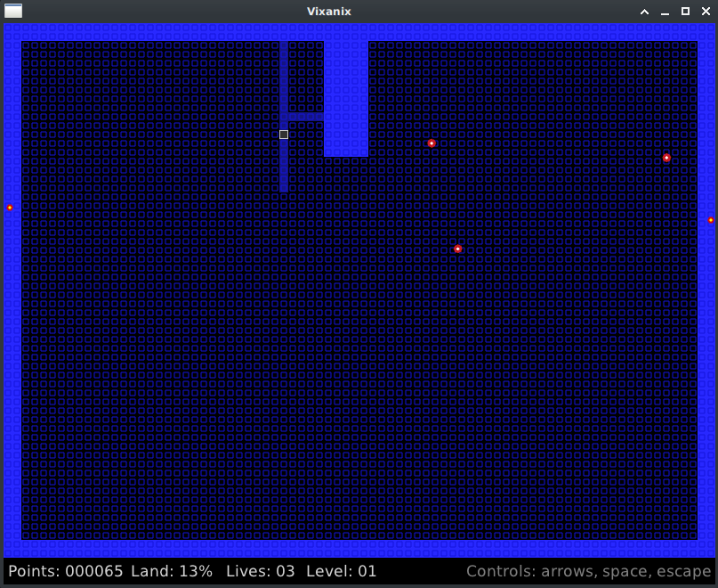

This is a remake of the classic game XONIX, originally by Ilan Rav & Dani Katz in 1984 (for MSDOS),
and then recreated/ported by Orlin Shopov to Apple II in 1986. See other versions of the game
at: https://archive.org/details/Xonix1984IlanRavAction , https://js-dos.com/xonix/
and https://www.facebook.com/groups/5251478676/posts/10161388995313677/ .

This remake is in the [V language](https://github.com/vlang/v) .

